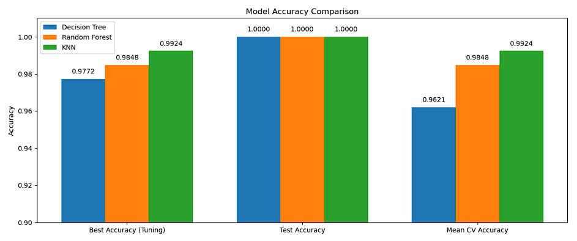
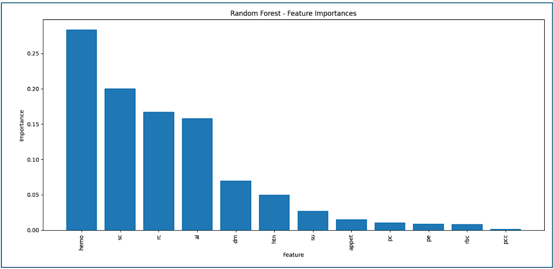

# Chronic Kidney Disease (CKD) Analysis

## Overview

This repository presents an end-to-end analysis of Chronic Kidney Disease (CKD) using clinical data. The project encompasses data preprocessing, robust machine learning modeling, and insightful visualizations to derive actionable insights for healthcare professionals and patients.

## Table of Contents

- [Overview](#overview)
- [Dataset](#dataset)
- [Key Insights](#key-insights)
- [Model Performance Comparison](#model-performance-comparison)
- [Feature Importance from Random Forest](#feature-importance-from-random-forest)
- [Recommendations](#recommendations)
- [How to Use](#how-to-use)
- [Contributors](#contributors)

## Dataset

- **Source:** [Chronic Kidney Disease Dataset (Kaggle)](https://www.kaggle.com/datasets/mansoordaku/ckdisease)
- **Records:** 400 patients
- **Attributes:** 25 clinical features (11 numerical, 14 nominal)
- **Timeframe:** ~2 months in a hospital setting

*Missing values are handled via mean/mode imputation.*

## Key Insights

- Hemoglobin and RBC count are inversely correlated with CKD.
- Hypertension, albumin, and serum creatinine are strong positive indicators.
- Outliers handled with winsorization; key features selected using Recursive Feature Elimination (RFE).

## Model Performance Comparison

The chart below compares the cross-validation accuracy achieved by each machine learning model evaluated in this project. Notably, the K-Nearest Neighbors (KNN) classifier outperformed others.



## Feature Importance from Random Forest

This chart highlights the top features ranked by their importance in the Random Forest model for CKD prediction. Higher values indicate greater contribution to model predictions.



## Recommendations

**For Healthcare Providers**
- Prioritize screening for patients with abnormal hemoglobin, serum creatinine, blood glucose, albumin, or hypertension.
- Integrate predictive models into clinical workflows for early CKD risk detection.
- Emphasize patient education on diabetes and hypertension management.

**For Patients**
- Follow medical advice and adopt preventive lifestyle changes if at risk.
- Schedule regular checkups, especially for those with known risk factors or family history.

## How to Use

1. **Clone this repository:**
   ```bash
   git clone https://github.com/donyal/CKD-Analysis.git
   cd CKD-Analysis
   ```

2. **Install the required packages:**  
   It's recommended to use a virtual environment.
   ```bash
   python -m venv venv
   source venv/bin/activate   # On Windows use: venv\Scripts\activate
   pip install -r requirements.txt
   ```

3. **Open and run the Jupyter notebooks:**  
   Start Jupyter Notebook or JupyterLab and open the provided `.ipynb` files to run the analysis step by step.
   ```bash
   jupyter notebook
   ```
   or
   ```bash
   jupyter lab
   ```

4. **(Optional) Download the dataset:**  
   Download the [Chronic Kidney Disease Dataset from Kaggle](https://www.kaggle.com/datasets/mansoordaku/ckdisease) and place the CSV file in the project directory as required by the notebooks.


## Contributors
  * Donyal Emami - @donyal
  * Joseph Irving - @catJoeIrving
  * Ryan Nguyen - @ryrynbob
